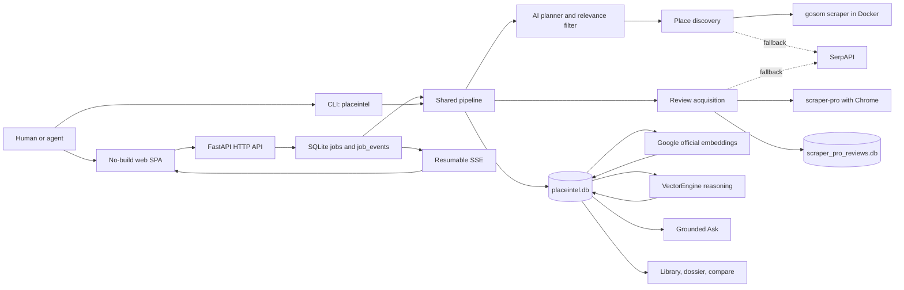

# PlaceIntel Architecture

Last verified: 2026-07-11 against v0.4.70 and GitNexus commit `7889902`.

This document owns the system map for PlaceIntel. Use `README.md` for setup and
first use, `docs/API.md` for the HTTP contract, `docs/agent-cli.md` for the
machine-facing CLI contract, and `docs/operations.md` for deployment and
recovery procedures.

## Purpose and Boundaries

PlaceIntel turns a natural-language need, shop name, or exact Google Maps URL
into evidence-backed place intelligence. It discovers candidate places, gathers
review evidence, caches the source data, generates per-place reports over all
cached reviews, and answers questions across or within cached places.

The product has three user-facing entry points over one Python core:

- A human CLI (`placeintel`) with JSON and NDJSON modes for agents.
- A FastAPI service (`placeintel-web`) exposing the HTTP API and job streams.
- A no-build browser SPA with Scout, Shop, Library, and Ask views.

This is currently a single-user local/protected service. The FastAPI process has
no app-level authentication and binds to loopback by default. Remote access must
stay behind a protected reverse proxy until an application auth contract is
implemented and verified.

## System Overview



## Runtime Entry Points

| Entry point | Owner | Responsibility |
| --- | --- | --- |
| `placeintel` | `placeintel/cli.py` | Human commands, stable JSON/NDJSON envelopes, exit codes, timeouts, backup/restore, diagnostics, and favorite refresh. |
| `placeintel-web` | `placeintel/server.py` | FastAPI routes, request validation, durable job creation, worker threads, SSE, static SPA serving, and safe settings APIs. |
| `/`, `/static/*` | `web/` | Accessible no-build SPA; consumes only documented APIs and escapes scraped/dynamic text before HTML rendering. |
| Python calls | `placeintel/pipeline.py` | Shared `scout`, `scout_single`, `ask`, and display-translation orchestration. |

Both CLI and web call the same pipeline. Business logic must not be reimplemented
in either adapter. The canonical progress event is:

```json
{"t": 1781440000.0, "stage": "search", "msg": "human readable", "data": {}}
```

Allowed stages are `plan`, `search`, `filter`, `reviews`, `embed`, `report`, and
`done`.

## Core Flows

### Scout: broad discovery

1. `pipeline.scout()` resolves output language and asks `planner.make_plan()`
   for intent, bilingual queries, location, profile, and mode.
2. Planning is fail-open. A provider failure produces a raw-query fallback
   instead of blocking discovery.
3. `_discover_multi()` reuses an exact fresh search or calls
   `discover.discover()` for each planned query. The primary discovery path is
   gosom in Docker; SerpAPI is the fallback.
4. Live discoveries preserve Google's relevance order. Cache hits may be ranked
   by review volume. `planner.filter_candidates()` explains relevance decisions
   and is also fail-open.
5. `_deep_dive()` fetches reviews for the selected places, updates SQLite,
   indexes new review vectors, and creates or reuses reports.
6. Search plans, candidate ids, filter verdicts, reports, errors, and progress
   events are persisted or returned through the shared `ScoutResult` contract.

### Shop: exact-place deep dive

`pipeline.scout_single()` converges on the same `_deep_dive()` path. For a
cached dossier action, `place_id` is authoritative and skips rediscovery. Short
or full Google Maps URLs retain their resolved identity so nearby places with
similar names cannot replace the user's selected place.

### Review acquisition and evidence guards

`reviews.fetch_reviews()` prefers the persistent scraper-pro database and Chrome
scraper, then falls back to SerpAPI. Important evidence rules are structural:

- Existing mapped scraper-pro rows are reused before launching Chrome.
- All subprocess DB, log, work, driver, and home paths resolve under writable
  `DATA_DIR`; vendor source is never runtime scratch space.
- A zero-row scraper result is an error when Google lists reviews.
- SerpAPI's 8-item first page is partial evidence when more reviews are listed
  and requested. Reports are not generated from that known-partial cache.
- A successful full scraper-pro result removes stale SerpAPI first-page rows so
  reports do not double-count evidence.
- `reviews.text` remains the scraped original. Translation is a separate display
  cache and never overwrites evidence.

### Report generation

`analyze.analyze_place()` reads every cached review for a place. Up to 400
reviews use one long-context pass. Larger sets use map-reduce with configurable
chunks, raw low-star reviews, and newest reviews in the reduce pass. Reports are
cached by place, profile, and language, and are reused only while no newer review
scrape exists. Generated Markdown is stored in SQLite and mirrored under
`data/reports/`.

Profiles are data-driven: `profiles/_core.yaml` merges into the selected
`profiles/*.yaml`. New analysis dimensions belong in YAML, not Python branches.

### Ask and evidence grounding

`pipeline.ask()` combines two evidence layers:

- Place listings for authoritative metadata such as address, hours, phone, and
  website.
- Semantic review hits from Google-generated vectors stored in SQLite.

The reasoning request includes today's date and returns both listing and review
evidence. QA cache keys include exact scope and answer language. A cached answer
is invalid once a newer review scrape exists for that same scope.

### Display translation

Review and report translation endpoints use the cheap translation provider role.
They cache by target language plus a source-content hash. Translation never
overwrites the scraped review text or generated source report; translated
Markdown uses the same escaped rendering path as original Markdown.

## Module Map

| Module | Owns |
| --- | --- |
| `config.py` | Paths, non-secret settings, credential discovery, provider routing, model listing and verified model switching. |
| `language.py` | Language-tag validation and precedence across CLI, API, reports, Ask, and translation. |
| `planner.py` | Maps URL parsing, AI plan, candidate filter, and target selection; AI failures degrade open. |
| `discover.py` | Google Maps place discovery through gosom, with SerpAPI fallback and source-shape normalization. |
| `reviews.py` | scraper-pro execution/database mapping, review normalization, partial-evidence detection, and SerpAPI review fallback. |
| `cache.py` | SQLite schema, additive migrations, source upserts, vectors, reports, QA, durable jobs, favorites, and deterministic activity risk. |
| `embed.py` | Google Embedding document/query vectors, retry, normalization, indexing, and semantic search. |
| `analyze.py` | Full-review single-pass or map-reduce report reasoning and Markdown rendering. |
| `pipeline.py` | End-to-end orchestration and the shared event/result contracts. |
| `photos.py` | Bounded source-photo URL metadata only; no image download or binary cache. |
| `profiles.py` | `_core.yaml` plus selected profile loading and merge. |
| `server.py` | FastAPI boundary, durable threaded jobs, SSE, API serialization, and static SPA. |
| `cli.py` | User/agent command surface, machine envelopes, safety flags, and process exit behavior. |
| `doctor.py` | Cheap local readiness and explicit deep diagnostics. |
| `backup.py` | Allow-list backup/restore with online SQLite backup and manifest hashes. |
| `deploy_smoke.py` | Read-only proof of version, health, shell, Library, dossier, and protected public access. |

## Data and Storage

`cache.connect()` opens SQLite in WAL mode with a 15-second busy timeout, creates
the schema, and applies additive migrations. This supports overlapping readers
and bounded concurrent writers without introducing a separate database service.

| Store | Role |
| --- | --- |
| `data/placeintel.db` | Canonical application cache: `places`, `reviews`, `review_vectors`, `reports`, `searches`, `qa`, `jobs`, `job_events`, `place_favorites`, `review_translations`, and `report_translations`. |
| `data/scraper_pro_reviews.db` | Persistent upstream scraper evidence and incremental state used before new browser work. |
| `data/settings.json` | Non-secret user preferences only, including the selected reasoning model and language defaults. |
| `data/reports/` | Generated Markdown report mirrors. |
| `data/backups/` | Manifested allow-list backup packages created by `placeintel backup`. |

Vectors are normalized `float32` BLOBs. Search uses NumPy brute-force cosine,
which is the deliberate simple design while the review corpus remains below
roughly 100,000 rows. Raw provider payloads remain in `*_json` columns for audit
and future parser improvements.

Do not hand-edit `data/` or `vendor/`. Backups include only the two databases,
non-secret settings, and generated reports; they exclude env files, logs, keys,
and SQLite sidecars.

## External Integrations and Provider Routing

| Capability | Primary | Fallback or note |
| --- | --- | --- |
| Place discovery | `gosom/google-maps-scraper` in Docker | SerpAPI `google_maps`. |
| Full review history | Vendored `google-reviews-scraper-pro` with Chrome | SerpAPI `google_maps_reviews`. |
| Review/query embeddings | Google official Gemini API | Explicit `types.Content` batches, count check, per-item fallback. |
| Report and Ask reasoning | VectorEngine Gemini-compatible API | Active model comes from verified live settings, never a baked-in UI list. |
| Review/report translation | VectorEngine cheap translation role | Separate model and cache from report reasoning. |
| Place identity/navigation | Google Maps URLs and ids | Short URLs are expanded with bounded, fail-open resolution. |

Credentials resolve in `config.py` from environment or approved local skill
configurations. Keys never belong in code, docs, `settings.json`, job events, or
API responses. Provider-facing exception text is redacted before persistence.

## Web and Job Architecture

The SPA is a bounded no-build surface served directly by FastAPI. `index.html`
loads base styles first, then purpose-owned `jobs.css`, `workspace.css`,
`dossier.css`, and `system.css`; scripts load `i18n.js`, `dossier.js`, `jobs.js`,
then `app.js`. Top-level views keep the `#scout`, `#shop`, `#library`, and `#ask`
deep-link contract, and every HTML/CSS/JS asset stays below 800 lines.

Scout and Shop requests create a `jobs` row before a daemon worker thread starts.
Every pipeline event appends to `job_events`. Browsers consume resumable SSE with
event ids and fall back to job polling. Server startup marks stale running jobs
from an older process as interrupted and supplies a cache-first retry hint.

There is no external queue, Redis, or multi-process job coordinator. Scaling to
multiple app workers would require a deliberate job-runner and ownership design;
starting more Uvicorn workers is not a transparent scaling change.

## Deployment and Security Boundary

The supported production chain is GitHub push, GitHub Actions, SSH deployment,
native systemd restart, and `placeintel deploy-smoke`. The application stays on
`127.0.0.1:9618` behind a protected proxy. Real hosts, domains, paths, auth
values, and health URLs remain in deployment secrets or local ignored files.

Security and cost boundaries:

- FastAPI validates request lengths, place counts, and review caps.
- Scraped text is hostile input and must pass through the SPA `esc()` helper.
- Cheap health never launches external tools or calls paid providers.
- Deep diagnostics and full Scout runs are explicit because they can spend
  credits or start Docker/Chrome.
- Destructive restore remains CLI-only, requires `--yes`, and validates hashes
  and database schema before replacement.
- App-level auth is not implemented as of this verification; proxy protection
  is part of the deployment boundary, not an optional hardening step.

## Architecture Invariants

The project constitution in `AGENTS.md` is authoritative. The most important
cross-module invariants are:

1. Planning and candidate filtering fail open; evidence completeness guards do
   not.
2. Embedding uses Google official credentials; reasoning uses VectorEngine.
3. Per-place reports analyze all cached reviews, while embeddings serve Ask.
4. Listings and review evidence both ground Ask.
5. Reviews and reports remain source-layer originals; translations are separate
   display-layer caches and never overwrite them.
6. Pipeline events are a public transparency contract shared by CLI and web.
7. Job state and events are durable SQLite data, not process-memory truth.
8. Exact place identity wins over rediscovery for dossier and Maps URL actions.
9. Model availability is queried live and a switch is smoke-tested before save.
10. UI dynamic/scraped content is escaped and no secret enters an API payload.

## When to Update This Document

Update `docs/architecture.md` in the same change when any of these move:

- App purpose, top-level user flows, or entry points.
- Module ownership or a shared pipeline boundary.
- SQLite tables, canonical stores, cache invalidation, or backup ownership.
- Provider routing, scraper/discovery integrations, or fallback behavior.
- Public event/result contracts, job durability, concurrency, or scaling model.
- Auth, network binding, deployment topology, or secret ownership.
- SPA view structure, API ownership, or source-of-truth relationships.

For exported functions, routes, types, or schemas, also update `docs/API.md` or
`docs/agent-cli.md` as applicable. Before architecture-affecting code edits, use
GitNexus impact analysis; before commit, run `detect-changes` against `main` and
the verification gates in `docs/operations.md`.
